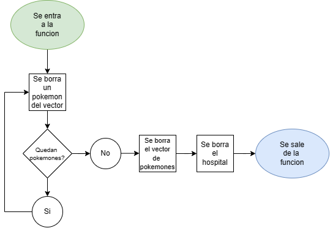

<div align="right">

</div>

# TP1

## Repositorio de Tomas Petrocini - 110157 - petrocinitomas@gmail.com 

- Para compilar:

```bash
línea de compilación
```

- Para ejecutar:

```bash
línea de ejecución
```

- Para ejecutar con valgrind:
```bash
línea con valgrind
```
---
##  Funcionamiento
El programa esta divido en dos archivos .c que se ocupan de distintas partes de la funcionalidad total, pokemon.c, que maneja todo lo relacionado a la estructura pokemon y tp1.c que maneja las estructuras de hospital, que tienen dentro suyo las estructuras pokemon.

En general el programa funciona recibiendo un archivo .txt el cual es recorrido linea a linea, generando registros pokemon y almacenandolos en un hospital y aumentando el tamaño de la memoria reservada por el vector de registros pokemon a medida que avanza por el archivo, todo este proceso esta compuesto por varios pasos de comprobacion de parametros y datos (en general todas las funciones del programa tienen alguna comprobacion de este estilo), reservacion de memoria y posteriormente de liberacion de memoria en caso de ser necesario. Si algun dato o parametro es "incorrecto"/nulo/en el formato equivocado entonces el proceso se interrumpe. En caso de que todo este en orden, la funcion principal devuelve un registro hospital con sus pokemones dentro.

Al finalizar este proceso tambien se ordenan los pokemones dentro del hospital en base a su salud ya que es importante para otras funciones. El ordenamiento es por burbujeo. (Por ejemplo, la funcion hospital obtener pokemon depende de que el vector de pokemones dentro del hospital este ordenado en forma creciente por salud).

Ademas hay una funcion que es un iterador para poder realizar operaciones decididas por el usuario a cada pokemon de un hospital (hospital a cada pokemon) y otra funcion para agregar mas pokemones a un hospital ya creado (hospital aceptar emergencias), los pokemones simplemente se agregan al final del vector (aumentando la memoria que se reservo para el vector de pokemones previamente) y luego son ordenados una vez mas por burbujeo.

Ambos archivos .c tambien cuentan con funciones que devuelven variables dentro de estructuras como pokemon_id por ejemplo, todas estas funciones comprueban que su parametro exista y sea correcto y luego devuelven lo que se les pide. Ademas de contar con funciones para liberar memoria de registros enteros o de partes de ellos, dependiendo la funcion.

Este es un ejemplo de como se guarda un hospital en memoria
<div align="center">

</div>

Y esto es como se libera la memoria de un hospital
<div align="center">

</div>

